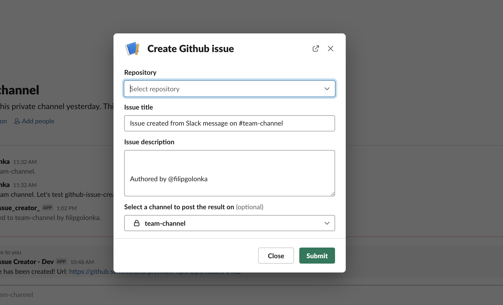
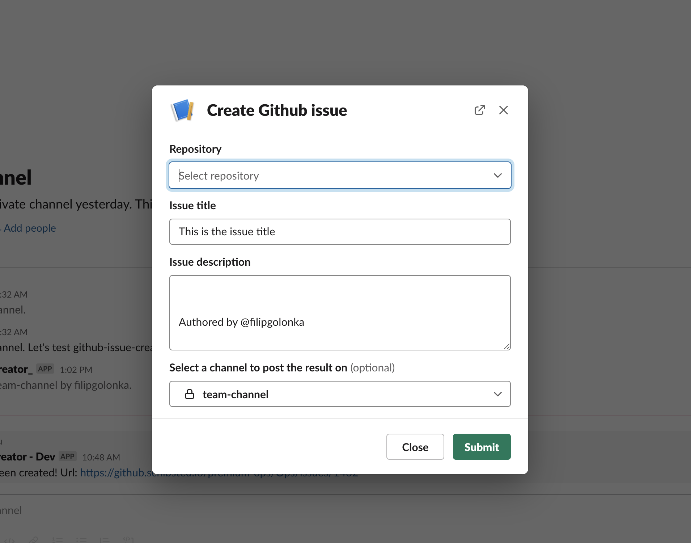
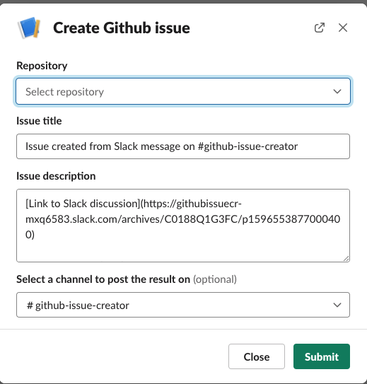

# Slack Github issue creator

Wouldn't it be cool to automate the process of creating Github issues directly from Slack messages? Just use this library and you are sorted! 

PS! Supports Github Enterprise as well :) 

## Setup

## Github token

* create personal access token - go to https://github.com/settings/tokens, click "Generate new token"
* give it reasonable name
* in "Select scopes" section make sure to check `repo` (and all subscopes), `read:org` and `user` (and all subscopes)
* click "Generate token", store safely the value which is displayed on the screen, we will need to use it later

## Slack application

* go to "Your apps" - https://api.slack.com/apps
* click "Create new app"
* fill in your app name, select Slack workspace where you would like to have this app available

* in "Basic information" screen you should see Client ID, secret and other credentials. Store "Signing secret" safely, we will need to use it later
 
* go to "Interactivity & shortcuts". Change the toggle position to "On"
* figure out what will be the url of your application - we will need "BASE_URL" value in the next steps
* in "Request URL" field provide following value "https://BASE_URL/create-github-issue"
* in "Select Menus" field provide following value "https://BASE_URL/external-select"
* in "Shortcuts" section click "Create New Shortcut", in the new screen choose "On messages". Give it reasonable name and short description - it will be displayed later in your Slack workspace. In "Callback ID" field type "create_issue".

* go to "OAuth&Permissions" menu
* in "Scopes" section click "Add an OAuth scope" under "Bot Token Scopes" and add "commands" scope.
* add also "users:read" scope

* go to "Install app" menu
* click "Install App to Workspace". In the new screen click "Allow". 
* Slack will display "Bot User OAuth Access Token". Store it safely, we will need to use it later

### Slash command

It is possible to use this app as a slash command bot. If configured properly, when you type `/your-slash-command` you will see empty modal that allows you to fill in Github issue details.



You can also define issue title as a part of slash command. Type `/your-slash-command This is the issue title`.



In order to configure this:
* on Slack open your app settings 
* click "Slash commands" on the left hand side menu
* click "Create new command"
* in "Command" input define your command (in my case - it's `create-github-issue`)
* define request url with following value: "https://BASE_URL/slash-command"
* optionally - define "Short description" and "Usage Hint"
* press "Save" and test it in your Slack workspace

## Your app

* install this package as dependency in your app - `npm install --save slack-github-issue-creator`
* in your index.js file:
```js
const express = require('express');
const createServer = require('slack-github-issue-creator');

const app = express();
const port = Number(process.env.PORT) || 3000;

const config = {
    githubToken: process.env.GITHUB_API_TOKEN,
    githubBaseUrl: 'https://api.github.com',
    slackApiToken: process.env.SLACK_API_TOKEN,
    slackSigningSecret: process.env.SLACK_SIGNING_SECRET,
    channelMap: {},
};

app.use(createServer(config));

app.listen(port, () => console.log(`Example app listening at http://localhost:${port}`));
```

* GITHUB_API_TOKEN - token created in "Github token" section
* SLACK_API_TOKEN - Bot User OAuth Access Token created when the app was installed to your workspace
* SLACK_SIGNING_SECRET - the value can be found in "Basic information" screen in your app, it is described also a bit above :) 

optionally you might want to change "githubBaseUrl", if your company uses Github Enterprise. The url then should be (most probably) `https://YOUR_GITHUB_URL/api`

### Channel map

It is possible to pass `channelMap` object in config. 
Let's assume that you have `#internal-dev-team` Slack channel and you use this addon very often there. You do not want to search for repository every team, when you click "Create github issue". So you can deliver predefined map in the config object to map this channel to specific repo.

Example:
```
const config = {
    // ...
    channelMap: {
        CHANNEL_ID: {
            name: 'my-github-org/my-repo',
            value: 'MDEwOlJlcG9zaXRvcnkzMTAwMDgzNDU=',
        },
    },
};
```
CHANNEL_ID can be found in the channel url. Open Slack app in your browser, navigate to your channel and use the id from url. Example:

`https://app.slack.com/client/T018YKBP4EL/C01T7PLL13N` -> `C01T7PLL13N` is the channel id


how to get this magic hash for your repo?

* open your repo in the browser and then open source code
* find `<meta name="hovercard-subject-tag">` html attribute
* it might look like this: `<meta name="hovercard-subject-tag" content="repository:310008345" data-pjax-transient="">`
* calculate base64 string for the value `010:RepositoryREPO_ID` - where REPO_ID is an integer that is a part of `content` attribute of html tag. In my case - `010:Repository310008345`. And the base64 string is `MDEwOlJlcG9zaXRvcnkzMTAwMDgzNDU=`

## Testing

Deploy your application, make sure you set your Slack application to have correct urls.

Go to Slack, hover over a message and click three dots icon. Then click "More message shortcuts..." and type the shortcut name you've chosen for your shortcut (it was done in "Interactivity & shortcuts" / "Shortcuts" in your app settings).

Assuming you've set everything properly, you should be able to see screen like this:



Choose repository, fill in other details and press "Submit". You should get the notification that your issue is now created 🎉

